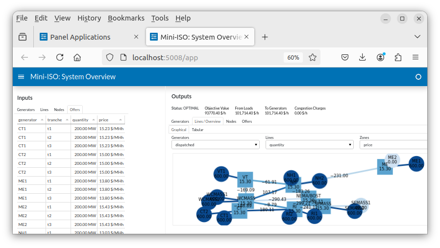
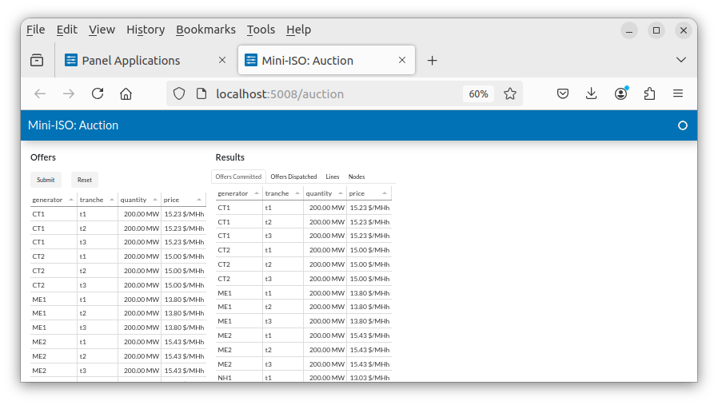
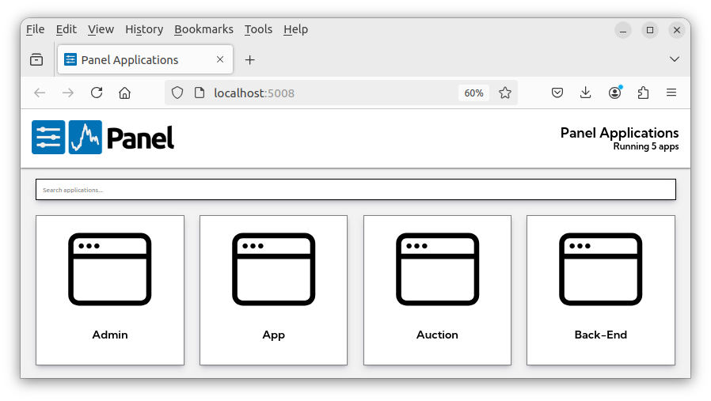

# Mini-ISO 

## Table of contents

- [Mini-ISO](#mini-iso)
  - [Table of contents](#table-of-contents)
  - [Description](#description)
    - [Datasets](#datasets)
    - [Use cases](#use-cases)
  - [How to install Mini-ISO](#how-to-install-mini-iso)
    - [Step 1: Install Git and Python](#step-1-install-git-and-python)
      - [Verification](#verification)
    - [Step 2: Clone the Mini-ISO repository](#step-2-clone-the-mini-iso-repository)
    - [Step 3: Install dependencies](#step-3-install-dependencies)
      - [Option A: Using `poetry` (recommended)](#option-a-using-poetry-recommended)
        - [Step 3.1: Install `pipx` and `poetry`](#step-31-install-pipx-and-poetry)
        - [Step 3.2: Install Python dependencies with `poetry`](#step-32-install-python-dependencies-with-poetry)
      - [Option B: Using `pip + venv`](#option-b-using-pip--venv)
  - [Key modules](#key-modules)
  - [How to run Mini-ISO](#how-to-run-mini-iso)
  - [To kill a process](#to-kill-a-process)
  - [Building a distribution](#building-a-distribution)
    - [Running the distribution](#running-the-distribution)

## Description

Mini-ISO is an interactive electricity market simulator for classroom use.

It provides three browser-based apps:

|     | Name            | Description                                                                                                                                                                                   | Screenshot                           |
| --- | --------------- | --------------------------------------------------------------------------------------------------------------------------------------------------------------------------------------------- | ------------------------------------ |
| 1.  | System Overview | Interactive simulator showing all network/market elements. Each update in the `Inputs` tabs triggers an update of the dispatch instructions and nodal prices displayed in the `Outputs` tabs. |      |
| 2.  | Offers Portal   | Interface for offer submissions and auction results.                                                                                                                                          |   |
| 3.  | Auction Screen  | Interface to aggregate offers and clear the market.                                                                                                                                           |  |
|     | App Menu        | In-browser selection of Mini-ISO apps                                                                                                                                                         |     |

### Datasets

Several datasets are shipped with this repository

|     | Name                                            | #Nodes | #Generators | Description                                                      |
| --- | ----------------------------------------------- | ------ | ----------- | ---------------------------------------------------------------- |
| 1.  | `mini_iso/datasets/one-zone`                    | 1      | 3           | A simple illustration of marginal pricing                        |
| 2.  | `mini_iso/datasets/zones-zones`                 | 3      | 2           | To illustrate congestion and price separation                    |
| 3.  | `mini_iso/datasets/mini-new-england-simple`     | 8      | 13          | Mini New England network with one offer tranche per generator    |
| 4.  | `mini_iso/datasets/mini-new-england-nonuniform` | 8      | 13          | Mini New England network with three offer tranches per generator |

To create a new dataset, follow the format of the files in the sample directory.
You'll need a three `.csv` files and a `.json` file that names them.

### Use cases

Classroom scenarios:

* Use the System Overview to illustrate offer stacks, marginal prices, locational marginal prices, and network congestion.
* Add a fun element of competition!
  - Assign a group of class members to each generator in the network.
  - Ask them to submit bids in the `Offers` app.
  - Every few minutes, clear the market via the `Auction` app and ask students to record their change in revenue.

> :warning: In a realistic environment, market participants would never see each others' offers, so ask class members not to peek!

## How to install Mini-ISO

### Step 1: Install Git and Python

**On macOS:**

```bash
# Option 1 (recommended): Homebrew
brew install git python@3.12

# Option 2: Official installers
# - Git: https://git-scm.com/download/mac
# - Python: https://www.python.org/downloads/macos/
```

**On Windows:**

```bash
winget install -e --id Git.Git
winget install -e --id Python.Python.3.12
```

**On Linux (Ubuntu/Debian):**

```bash
sudo apt update
sudo apt install -y git python3 python3-venv python3-pip
```

#### Verification

Verify that both Git and Python are available on your `PATH`:

```bash
git --version
python3 --version
```

---
### Step 2: Clone the Mini-ISO repository

```bash
git clone https://github.com/ne-pearl/mini-iso.git
cd mini-iso
```

---

### Step 3: Install dependencies

#### Option A: Using `poetry` (recommended)

##### Step 3.1: Install `pipx` and `poetry`

**On macOS:**

```bash
# Option 1: Homebrew
brew install pipx
# Option 2: Conda
conda install -c conda-forge pipx

pipx ensurepath
pipx install poetry
```

**On Windows:**

```bash
py -m ensurepip --upgrade
py -m pip install --user pipx
pipx ensurepath
pipx install poetry
```

**On Linux (Ubuntu/Debian):**

```bash
python3 -m pip install --user pipx
pipx ensurepath
pipx install poetry
```

##### Step 3.2: Install Python dependencies with `poetry`

```bash
poetry env use 3.12
poetry install
```

#### Option B: Using `pip + venv`

**On macOS / Linux:**

```bash
python3 -m venv .venv
source .venv/bin/activate
pip install -r requirements.txt
```

**On Windows:**

```bash
py -m venv .venv
.\.venv\Scripts\activate
pip install -r requirements.txt
```

## Key modules

| Path                                                                                               | Description                                |
| -------------------------------------------------------------------------------------------------- | ------------------------------------------ |
| [mini_iso/auction.py](https://github.com/ne-pearl/mini-iso/blob/main/mini_iso/auction.py#L56)      | Panel definition for `Auction` app         |
| [mini_iso/bidders.py](https://github.com/ne-pearl/mini-iso/blob/main/mini_iso/bidders.py#L182)     | Panel definition for `Offers` app          |
| [mini_iso/clearance.py](https://github.com/ne-pearl/mini-iso/blob/main/mini_iso/clearance.py#L190) | Economic dispatch model in `gurobipy`      |
| [mini_iso/dashboard.py](https://github.com/ne-pearl/mini-iso/blob/main/mini_iso/dashboard.py#L971) | Panel definition for `System Overview` app |
| [mini_iso/typing_.py](https://github.com/ne-pearl/mini-iso/blob/main/mini_iso/typing_.py#L16)      | Shared type definitions                    |

---

## How to run Mini-ISO

```bash
cd your/path/to/mini-iso
poetry env activate
poetry run python mini_iso/apps.py ./mini_iso/datasets/mini-new-england-multi
```

## To kill a process

If you encounter a message like `Cannot start Bokeh server, port 5006 is already in use`, try the following commands.

**In MacOS & Linux:**

```bash
# Copy process id, e.g., 12345
lsof -i :5006  

# Kill process
kill -9 12345
```

**In Windows:**

In `cmd`:

```bash
# Copy process id, e.g., 12345
netstat -ano | findstr :5006  

# Kill process
taskkill /PID 12345 /F
```

```powershell
# Copy process id, e.g., 12345
Get-Process -Id (Get-NetTCPConnection -LocalPort 5006).OwningProcess | Stop-Process -Force

# Kill process
taskkill /PID 12345 /F
```

---

## Building a distribution

The steps explain the use of [PyInstaller](https://pyinstaller.org/) to bundle Mini-ISO and its dependencies into a single (platform-dependent) executable file. 

> :warning: This shouldn't be necessary (as all dependencies should already have been specified in `pyproject.toml`), I seem to have run into problems.

```bash
poetry add \
    altair dask[dataframe] gurobipy hypothesis ipython matplotlib \
    networkx pandas pandera panel pydantic pyinstaller pytest scipy
poetry update
```

**On Linux:**

```bash
poetry env activate
poetry env use 3.12

# Required for python shared object files
sudo apt-get install python3.12-dev  # or python3.11-dev etc.

# Local copy of gurobi.lic from PyPI 
cp echo $(which python)/site-packages/gurobipy/.libs/gurobi.lic .

# Create redistributable (only for your platform)
cd your/path/to/mini-iso
pyinstaller \
    mini_iso/app.py \
    --hiddenimport pydantic.deprecated.decorator \
    --add-data ./gurobi.lic:gurobipy/.libs/

# To run
./dist/app/app \
    $(realpath mini_iso/datasets/mini_new_england/mini_new_england.json)
```

**On Windows:**

> For now, please see my notes in `windows.md`.

- [ ] Update this document for Windows.

### Running the distribution

> :warning: When running the Mini-ISO bundle, you may encounter an error about an expired GUROBI license.
> This might indicate that you have an expired `gurobi.lic` file in your home directory (which GUROBI checks first, before the copy in the Mini-ISO folders).
> To resolve, please remove/rename the expired file.
